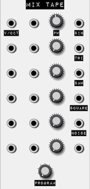

# ProtoTools

Prototyping modules for VCVRack.

This project is to help with quick prototyping of modules using Javascript.
When prototyping physical modules, it is common to use a hardware setup with
inputs, knobs, and outputs, with labels stuck on.  ProtoTools emulates this
while giving a Javascript interface for rapid prototyping.

Modules created with ProtoTools are not meant to be used as distributed
production modules, but instead as a way to play with new ideas and concepts
without being tied down.

In addition, ProtoTools aims to help new module developers by documenting the
creation process, from code to graphics.

You can documentation for various aspects of ProtoTools:

* [Layout](docs/Layout.md) - basics of ProtoTools Layouts and Standards
* [Modules](docs/Modules.md) - Included modules and `require` system
* [API](docs/API.md) - Javascript API
* [Programs](docs/Programs.md) - Writing programs

NOTE: due to the nature of the underlying Javascript engine, it is recommended
to only run one ProtoTools module at a time, as there will be unpredictable
results otherwise.

This may change in the future.

## Mix Tape

Mix Tape is a large prototyping module with `12 inputs`, `6 parameters`,
`6 outputs`, and `9 programs`.

