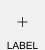

# ProtoTools Layout and Standards

This document describes the grid system that ProtoTools uses for layout,
including labels, knobs, and ports.  These standards are useful when developing
your own modules.

## VCVRack SVG Standards

Eurorack standards are defined as `3U` (Rack Units) tall and measured in `HP`
(Horizontal Pitch) for width.  VCVRack uses SVG sizes to emulate these rack
standards:

* `1HP` - `15px`
* `1U` - `126.667px`

Thereby, the smallest VCVRack panel will be `1HP` x `3U`, or `15px` x `380px`.

## ProtoTools Standards

ProtoTools expands on the VCVRack standards by defining modules to be in
widths of `3HP` or `45px`.  This allows for a label and a grid of 7 rectangular
elements, `45px` wide, and `50px` tall.

### Module Name

Module names, or titles, are given a place at the top of the module.  They use
a `12px` font, and are placed in the horizontal middle of the module, `25px`
from the top:

```
<text
  style="font-size:12px;font-family:Arial;text-anchor:middle;fill:#000000"
  x="22.5"
  y="25"
  font-size="12px">NAME</text>
```

### Elements

There are seven elements stacked vertically per `3HP`.  Each element consists
of a port, knob, or light, and a label.



The first Element begins at `21px` from the top, and ends at `70px`.

#### Port

Each port uses `ProtoPort` as defined in [`components.hpp`](../src/lib/components.hpp).  The port is positioned `10px`
horizontally from the left of the element, and `14px` from the top of the
element.  Thus the first port would be placed at `10px` left, and `35px` down:

```
addInput(Port::create<ProtoPort>(Vec(10, 35), Port::INPUT, module,
         Module::PORT_ID));
```

#### Knob

Each knob uses `ProtoKnob` as defined in [`components.hpp`](../src/lib/components.hpp).  The knob is positioned `9px`
horizontally from the left of the element, and `30px` from the top of the
element.  Thus the first port would be placed at `10px` left, and `30px` down:

```
addParam(ParamWidget::create<ProtoKnob>(Vec(10, 30), module
         Module::KNOB_ID, 0.0f, 100.0f, 0.0f));
```

#### Label

Labels are placed horizontally at `22.5px` from the left of the element, and
`49px`from the top of the element.  Thus the first label would be placed at
`22.5px` left, and `70px` down using a `10px` font:

```
<text
  style="font-size:10px;font-family:Arial;text-anchor:middle;fill:#000000"
  x="22.5"
  y="70"
  font-size="10px">LABEL</text>
```
